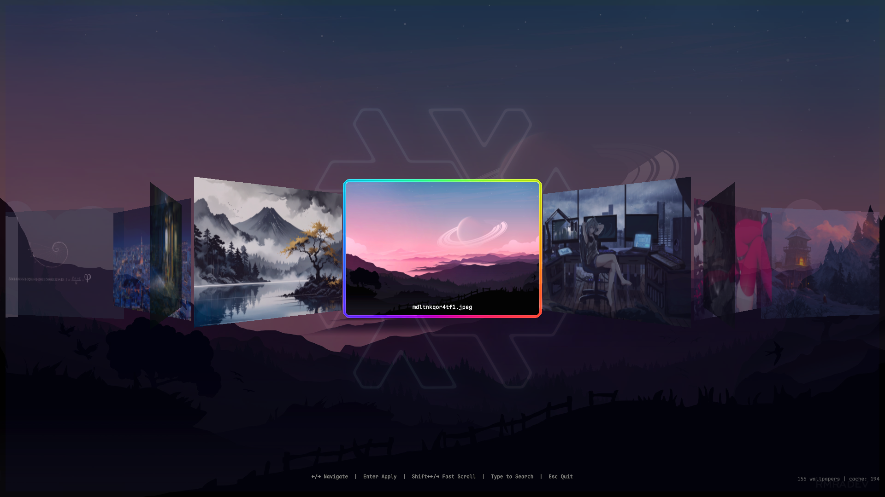

# npaper

A Quickshell-based wallpaper selector for Wayland compositors.

## Preview



## Features

- 🖼️ Image and video wallpaper support
- 🎨 Smooth transition effects (via swww)
- 🔍 Search and filter wallpapers
- 🎯 CoverFlow-style UI
- ⚡ Concurrent thumbnail generation

## Dependencies

### Required

- **swww** - Wallpaper daemon with transitions
- **wlr-randr** - Monitor detection
- **Quickshell** - QML-based Wayland shell

### Optional

- **mpvpaper** - Video/live wallpaper support
- **ffmpeg** - Thumbnail generation
- **imagemagick** - Dynamic logo color extraction (extracts dominant wallpaper color)

### Installation (Arch Linux)

```bash
sudo pacman -S swww wlr-randr mpvpaper ffmpeg imagemagick
```

## Usage

### Quickshell Widget

```bash
qs -c npaper
```

### CLI

```bash
# List all wallpapers
./wallpaper.sh --list

# Apply a wallpaper
./wallpaper.sh --apply /path/to/wallpaper.jpg

# Show help
./wallpaper.sh --help
```

## Configuration

### Wallpaper Directory

Edit `wallpaper.sh` to change the default wallpaper directory:

```bash
readonly WALLPAPER_DIRS=(
    "$HOME/Pictures/wallpapers"
)
```

### Thumbnail Cache

Thumbnails are cached in `~/.cache/wallpaper_thumbs`.

## Keyboard Shortcuts

| Key                       | Action                  |
| ------------------------- | ----------------------- |
| `←` / `→`                 | Navigate wallpapers     |
| `Shift + ←` / `Shift + →` | Fast scroll (5 items)   |
| `Enter`                   | Apply wallpaper         |
| `Type`                    | Search by filename      |
| `Backspace`               | Delete search character |
| `Esc` / `Tab`             | Quit                    |

## Project Structure

```
npaper/
├── wallpaper.sh          # CLI script
├── shell.qml             # Quickshell UI
├── assets/
│   └── nixos-logo.svg    # NixOS logo for watermark
├── shaders/
│   ├── borderGlow.frag   # Shader source
│   └── borderGlow.frag.qsb  # Compiled shader
└── README.md
```

## License

This project is licensed under the BSD 3-Clause License.

---

> If you find `npaper` useful, please give it a ⭐ and share! 🎉
